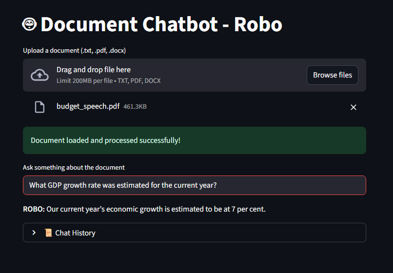
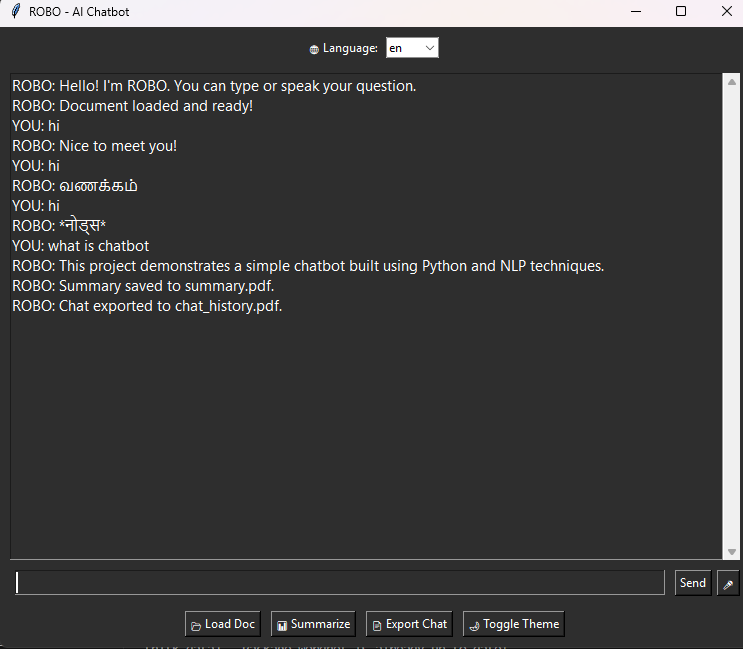

# 🤖 ROBO – Document Chatbot

## 📑 Project Overview

**Robo** is a modular multi-interface chatbot for intelligent Q\&A and summarizing over user-uploaded documents (TXT, PDF, DOCX). Built in Python, Robo supports conversation via command-line, GUI (Tkinter/Streamlit), and voice (speech-to-text, text-to-speech), leveraging TF-IDF/NLP for relevant retrieval and spaCy for extractive summarization.

***

##  Features

- **Document Upload \& Parsing:** TXT, PDF, DOCX
- **Accurate Q\&A:** Asks questions about uploaded documents; fast retrieval with TF-IDF and cosine similarity
- **Text Summarization:** Extracts concise summaries using spaCy NLP
- **Multiple Interfaces:**
    - **Tkinter GUI:** User-friendly desktop interface
    - **Streamlit Web UI:** Modern web interface
    - **Command-line (CLI):** Quick terminal access
    - **Voice Input/Output:** Speech recognition and TTS
- **Multilingual Support:** Quick translation and responses in several languages
- **PDF Export:** Save summaries and chat logs to PDF

***

##  Screenshots

### 1. Web UI (Streamlit)


*Ask natural questions, upload PDFs... modern UI.*

### 2. Classic Desktop GUI (Tkinter)


*Rich desktop experience with chat, translate, summarize and export.*

***

##  Installation

### **Clone the Repository**

```bash
git clone https://github.com/ShyamSanjeyS/ROBO-Document-Chatbot.git
cd ROBO-Document-Chatbot
```


### **Requirements**

- Python 3.8+
- `nltk`, `spacy`, `sklearn`, `numpy`, `pandas`, `pyttsx3`, `speechrecognition`, `deep-translator`, `fpdf`, `fitz` (PyMuPDF)


### **Install Dependencies**

```bash
pip install -r requirements.txt
python -m spacy download en_core_web_sm
```


***

## 🛠️ Usage

#### 1. **Streamlit Web Interface**

```bash
streamlit run chatpdf.py
```


#### 2. **Desktop GUI (Tkinter)**

```bash
python GuiTK.py
# or
python RoboApp.py
```


#### 3. **Command Line**

```bash
python SimpleChat.py
# or
python clichat.py load mydoc.pdf
python clichat.py ask "What is the main topic?"
```


#### 4. **Voice-Enabled Chatbot**

```bash
python VoiceChat.py
```


***

##  Core Logic

- **Preprocessing:** Documents are tokenized, normalized, and indexed
- **TF-IDF Vectorizer:** All sentences vectorized for fast semantic search
- **Cosine Similarity:** User queries are matched to document sentences
- **spaCy Summarizer:** Computes frequency-based summary over key sentences

***

##  Multilingual \& Voice

- **Translation:** Switch chat to Tamil, Hindi, French, German, Spanish (Tkinter only)
- **TTS \& Speech Recognition:** Natural conversation with microphone and speakers

***

## 📦 Project Structure

```
chatpdf.py         # Streamlit web UI
GuiTK.py           # Tkinter GUI
RoboApp.py         # Tkinter + TTS + Speech + Multilingual + Export
SimpleChat.py      # CLI chatbot
clichat.py         # CLI with persistent context
VoiceChat.py       # Voice-enabled chatbot
core.py            # Core NLP functionality (importable)
readme.md          # This documentation
```


***

##  Example Commands

- **Get a summary:** Type `~summarize` or use Summarize button
- **Export chat:** Click Export Chat (Tkinter UI)
- **Change language:** Select language drop-down (Tkinter UI)
- **Voice query:** Press 🎤 (Tkinter UI) or speak when prompted (VoiceChat)

***

##  Future Improvements

- Add advanced Q\&A (OpenAI LLM or transformers)
- Enhance summarizer with neural techniques
- Web deployment for remote/concurrent usage

***

## 📝 License

This project is Open Source under the [MIT License](LICENSE).

***

##  Credits 

Built using Python, NLTK, spaCy, scikit-learn, Tkinter, Streamlit, and more.
**Contributions are welcome!**

***

## 👤 Author \& Contact

**ShyamSanjey**
🔗 [LinkedIn](www.linkedin.com/in/shyamsanjey2004)
🔗 [GitHub](https://github.com/ShyamSanjeyS)
✉️ shyamsanjey.s@gmail.com

### Suggestions/Feature Requests

Write to: `shyamsanjey.s@gmail.com`

***

<div style="text-align: center">⁂</div>

